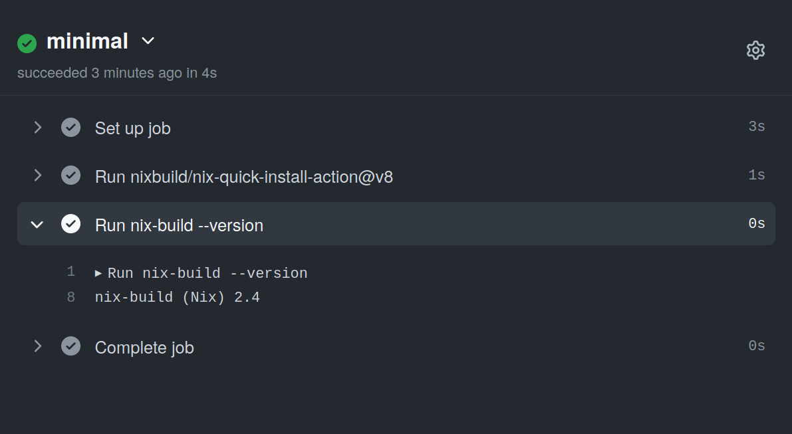
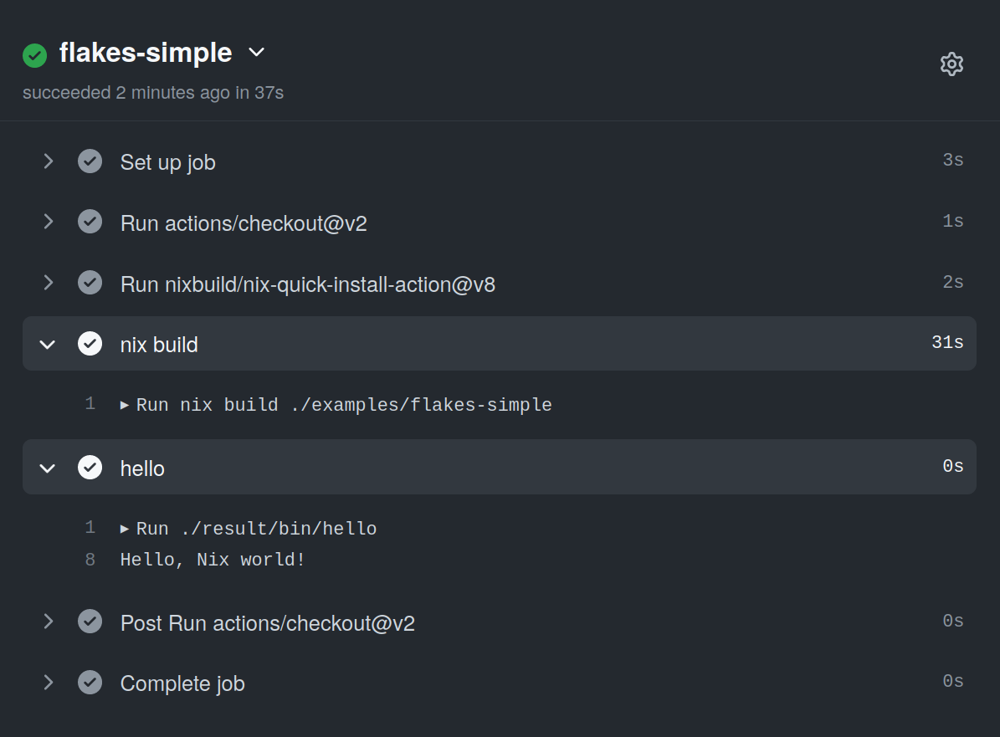

# Nix Quick Install Action

This GitHub Action installs [Nix](https://nixos.org/nix/) in single-user mode,
and adds almost no time at all to your workflow's running time.

For the moment, this action only support Linux runners.

There are inputs for selecting which Nix version to use, and to specify
`nix.conf` contents. The Nix installation is deterministic &ndash; for a given
release of this action the resulting Nix setup will always be identical, no
matter when you run the action.

## Description

To make this action as quick as possible, the installation is minimal: no
nix-daemon, no nix channels and no `NIX_PATH`. The nix store (`/nix/store`) is
owned by the unprivileged runner user.

The action provides you with a fully working Nix setup, but since no `NIX_PATH`
or channels are setup you need to handle this on your own. Nix Flakes is great
for this, and works perfectly with this action (see below).
[niv](https://github.com/nmattia/niv) should also work fine, but has not been
tested yet.

If this action doesn't work out for your use case, you should look at the
[Install Nix](https://github.com/marketplace/actions/install-nix) action,
which sets up Nix in multi-user mode (daemon mode).

## Inputs

See [action.yml](action.yml) for documentation of the available inputs.
The available Nix versions are listed in the [release
notes](https://github.com/nixbuild/nix-quick-install-action/releases/latest).

## Usage

### Minimal example

The following workflow installs Nix and then just runs
`nix-build --version`:

```yaml
name: Examples
on: push
jobs:
  minimal:
    runs-on: ubuntu-latest
    steps:
      - uses: nixbuild/nix-quick-install-action@v2
      - run: nix-build --version
```



### Using Nix flakes

To be able to use Nix flakes you need to specify a version of Nix that supports
it, and also enable the flakes functionality in the nix configuration:

```yaml
name: Examples
on: push
jobs:
  flakes-simple:
    runs-on: ubuntu-latest
    steps:
      - uses: actions/checkout@v2
      - uses: nixbuild/nix-quick-install-action@v2
        with:
          nix_version: 3.0pre20200829_f156513
          nix_conf: experimental-features = nix-command flakes
      - name: nix build
        run: nix build ./examples/flakes-simple
      - name: hello
        run: ./result/bin/hello
```



You can see the flake definition for the above example in
[examples/flakes-simple/flake.nix](examples/flakes-simple/flake.nix).

### Using Cachix

You can use the [Cachix action](https://github.com/marketplace/actions/cachix)
together with this action, just make sure you put it after this action in your
workflow.
